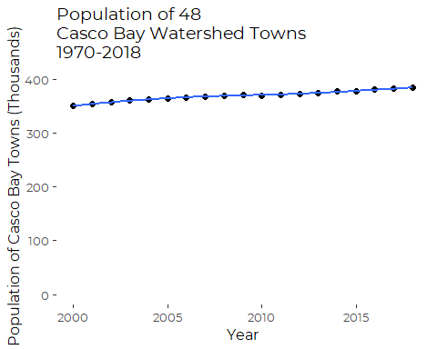
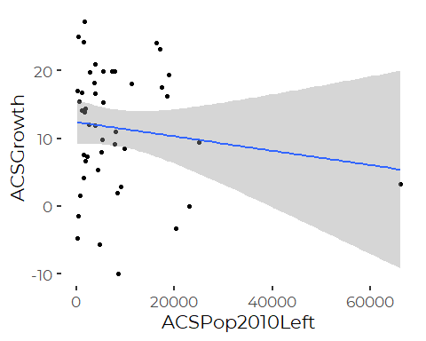
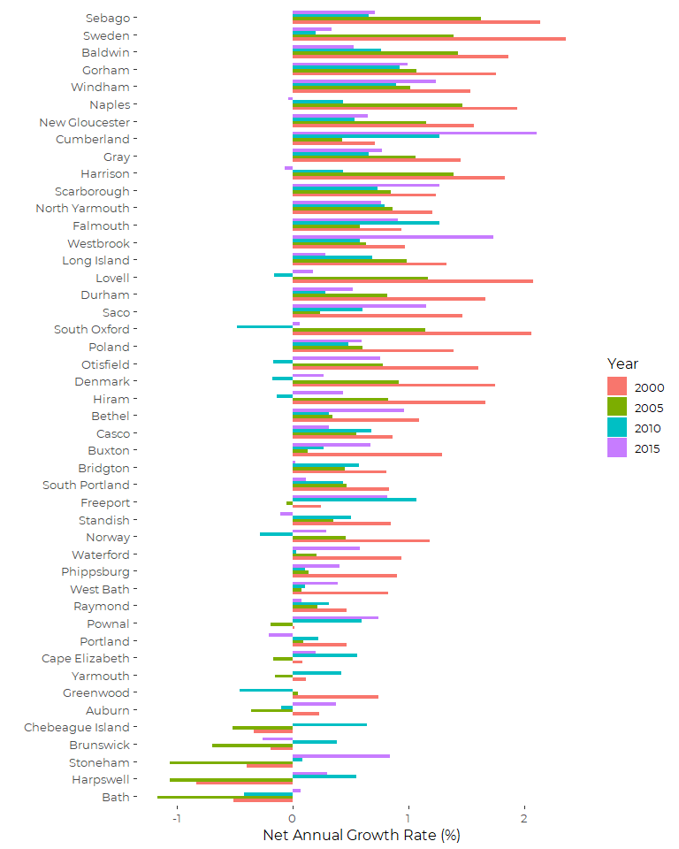
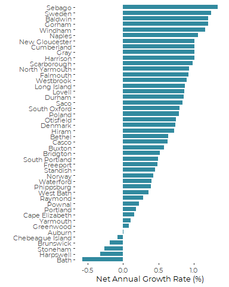

Totals and Rates from ACS Population Estimates
================
Curtis C. Bohlen, Casco Bay Estuary Partnership.
06/01/2022

-   [Introduction](#introduction)
-   [Install Libraries](#install-libraries)
-   [Load Data](#load-data)
-   [Reshape Data](#reshape-data)
-   [Summarize Data](#summarize-data)
-   [Quick and Dirty Population Growth
    Figures](#quick-and-dirty-population-growth-figures)
-   [Population Growth Rates](#population-growth-rates)
    -   [Convenience Functions](#convenience-functions)
    -   [Test the functions](#test-the-functions)
-   [Assemble a Data Table](#assemble-a-data-table)
    -   [Growth over the Period of the American Community Survey 2000 -
        2018](#growth-over-the-period-of-the-american-community-survey-2000---2018)
    -   [ACS growth in 2000 to 2005](#acs-growth-in-2000-to-2005)
    -   [ACS growth in 2005 to 2010](#acs-growth-in-2005-to-2010)
    -   [ACS growth in 2010 to 2015
        only](#acs-growth-in-2010-to-2015-only)
    -   [ACS growth in 2015 to 2018
        only](#acs-growth-in-2015-to-2018-only)
    -   [Assemble a consistent data
        set](#assemble-a-consistent-data-set)
-   [Plot Recent Growth vs. Size](#plot-recent-growth-vs-size)
-   [Plot Five Year Rates of Growth](#plot-five-year-rates-of-growth)


# Introduction

We are all familiar with the U.S. Census, or at least we think we are.

Population growth and land use are key determinants of pollution loading
to Casco Bay as well as habitat disturbance and disruption throughout
the watershed.

The connection between population to environmental impact is not direct,
as it is mediated by affluence, technology, culture and more.
Nonetheless, population change, especially differential population
change across the region, helps us understand the demographic forces
shaping Maine’s landscape.

We use data from the U.S. Census and related products from the census to
track demographic change. Since State of the BAy Reports are issues
every five years and the census is conducted every tewn, we must look
not only to the decennial census, but alsio to intermediate population
estimates released by the U.S Census Bureau, related the the “American
Community Survey.”

In this notebook, we access demographic data on a town by town basis
derived from census data, and derive growth rate statistics for a
variety of time periods.

This Notebook is not the same as the original Notebook used to conduct
these calculations, but it contains the same calculations.

# Install Libraries

``` r
library(readr)
library(tidyverse)
#> -- Attaching packages --------------------------------------- tidyverse 1.3.1 --
#> v ggplot2 3.3.5     v dplyr   1.0.7
#> v tibble  3.1.6     v stringr 1.4.0
#> v tidyr   1.1.4     v forcats 0.5.1
#> v purrr   0.3.4
#> -- Conflicts ------------------------------------------ tidyverse_conflicts() --
#> x dplyr::filter() masks stats::filter()
#> x dplyr::lag()    masks stats::lag()

library(CBEPgraphics)
load_cbep_fonts()
theme_set(theme_cbep())
```

# Load Data

``` r
the_data <- read_csv("CB_Population_2000-2018_Combined.csv")
#> Rows: 47 Columns: 27
#> -- Column specification --------------------------------------------------------
#> Delimiter: ","
#> chr  (2): NAME, NAMELSAD
#> dbl (25): ALAND, AWATER, COUSUB, Base 2000, Estimate 2000, Estimate 2001, Es...
#> 
#> i Use `spec()` to retrieve the full column specification for this data.
#> i Specify the column types or set `show_col_types = FALSE` to quiet this message.
```

# Reshape Data

``` r
long_data <- the_data %>%
  rename(`Estimate2 2010` = `Estimate 2010 v2010`) %>%
  pivot_longer(`Base 2000`:`Estimate 2018`, 
               names_to = "Type", 
               values_to = "Population") %>%
  #gather(key=Type, value ='Population', `Census 1970`:`Estimate 2018`) %>%
  separate(Type, c('Group', 'Year'), sep = ' ') %>%
  mutate(Year = as.numeric(Year)) %>%
  mutate(YearF = factor(Year, levels = c(1970, 1980, 1990, 2000, 2001, 2002, 
                                         2003, 2004, 2005, 2006, 2007, 2008, 
                                         2009, 2010, 2011, 2012, 2013, 2014, 
                                         2015, 2016, 2017, 2018)))
```

# Summarize Data

``` r
total <- long_data %>%
  group_by(Group, Year) %>%
  summarize(Total = sum(Population, na.rm=TRUE)) %>%
  ungroup()
#> `summarise()` has grouped output by 'Group'. You can override using the `.groups` argument.
total
#> # A tibble: 22 x 3
#>    Group     Year  Total
#>    <chr>    <dbl>  <dbl>
#>  1 Base      2000 349833
#>  2 Base      2010 369988
#>  3 Estimate  2000 350533
#>  4 Estimate  2001 353593
#>  5 Estimate  2002 356684
#>  6 Estimate  2003 360073
#>  7 Estimate  2004 362658
#>  8 Estimate  2005 364367
#>  9 Estimate  2006 365449
#> 10 Estimate  2007 367266
#> # ... with 12 more rows
write.csv(total, 'CB_Total_Pop.csv')
```

# Quick and Dirty Population Growth Figures

``` r
tmp <-  total %>%
  filter(Group == 'Estimate')

plt <- tmp %>%
  ggplot(aes(Year, Total/1000)) + geom_point( size = 2) +
  geom_smooth(method = 'loess', span=0.75) +
  xlab('Year') +
  ylab('Population of Casco Bay Towns (Thousands)') +
  theme_cbep(base_size = 12) +
  scale_y_continuous(limits = c(0,400))+
  ggtitle('Population of 48\nCasco Bay Watershed Towns\n1970-2018')
plt
#> `geom_smooth()` using formula 'y ~ x'
```


The full Y scale minimizes the visibility of the population slow down
and even contraction from 2008 to 2010, but it is more honest in terms
of the magnitude of growth. HOWEVER the apparent population decline
could also be because the ACS is “recalibrated” with every decennial
census.

# Population Growth Rates

We want population growth rates for Each town, and we have several
possibly interesting periods of record:

1.  Total Period of ACS Records, 2000 through 2018  
2.  Recent 5 year periods

The easiest way to calculate a growth rate is in terms of the first and
last years of a period of record only.

## Convenience Functions

``` r
Tot.Pct.Change <- function(pops, yrs)
{
  firstpop <- pops[which.min(yrs)][1]  # could be multiple values in a given year...  select first one.
  firstyr <-   yrs[which.min(yrs)][1]
  lastpop <- pops[which.max(yrs)][1]
  lastyr <-   yrs[which.max(yrs)][1]
  tot <- 100*(lastpop-firstpop)/firstpop
  return(tot)
}
```

``` r
Ann.Pct.Change <- function(pops, yrs)
{
  firstpop <- pops[which.min(yrs)][1]  # could be multiple values in a given year...  select first one.
  firstyr <-   yrs[which.min(yrs)][1]
  lastpop <- pops[which.max(yrs)][1]
  lastyr <-   yrs[which.max(yrs)][1]
  ann <- ((exp((log(lastpop)-log(firstpop))/(lastyr-firstyr)))-1)*100
  return(ann)
}
```

## Test the functions

``` r
Tot.Pct.Change(tmp$Total, tmp$Year)
#> [1] 9.514939
Ann.Pct.Change(tmp$Total, tmp$Year)
#> [1] 0.5062258
```

So, over the past 18 years, the region has grown at an average rate of
about 0.5% a year.

# Assemble a Data Table

## Growth over the Period of the American Community Survey 2000 - 2018

``` r
tmp <- long_data %>%
  filter(Group =="Estimate") %>%
  filter(! is.na(Population) & Population !=0) %>%
  mutate(Source = ifelse(Group=='Estimate2', 'Estimate', Group)) %>%
  mutate(Source = ifelse(Source=='Estimate', 'ACS', Source)) %>%
  select(-Group) %>%
  filter(Source == 'ACS')

ACSGrowth <- tmp %>%
  group_by(NAME) %>%
  summarize(NAMELSAD=first(NAMELSAD),
            COUSUB = first(COUSUB),
            ACSFirstYr = min(Year),
            ACSAnnRate = Ann.Pct.Change(Population, Year),
            ACSGrowth = Tot.Pct.Change(Population, Year)) %>%
  ungroup()
ACSGrowth
#> # A tibble: 47 x 6
#>    NAME             NAMELSAD              COUSUB ACSFirstYr ACSAnnRate ACSGrowth
#>    <chr>            <chr>                  <dbl>      <dbl>      <dbl>     <dbl>
#>  1 Auburn           Auburn city             2060       2000   0.000719    0.0129
#>  2 Baldwin          Baldwin town            2655       2000   1.21       24.2   
#>  3 Bath             Bath city               3355       2000  -0.581      -9.96  
#>  4 Bethel           Bethel town             4825       2000   0.636      12.1   
#>  5 Bridgton         Bridgton town           7170       2000   0.519       9.78  
#>  6 Brunswick        Brunswick town          8430       2000  -0.187      -3.32  
#>  7 Buxton           Buxton town             9410       2000   0.580      11.0   
#>  8 Cape Elizabeth   Cape Elizabeth town    10180       2000   0.161       2.93  
#>  9 Casco            Casco town             11125       2000   0.630      12.0   
#> 10 Chebeague Island Chebeague Island town  12300       2000  -0.0785     -1.40  
#> # ... with 37 more rows
```

## ACS growth in 2000 to 2005

``` r
tmp <- long_data %>%
  filter(Group != 'Base') %>%
  mutate(Source = ifelse(Group=='Estimate', 'ACS', Group)) %>%
  select(-Group) %>%
  filter(Source == 'ACS') %>%
  filter(! is.na(Population) & Population !=0)

tmp2 <- tmp %>%
  filter(Year>1999 & Year < 2006)   # ONLY  2000 to 2005

ACSGrowth2000 <- tmp2 %>% group_by(NAME) %>%
  summarize(ACS2000AnnRate = Ann.Pct.Change(Population, Year),
            ACSPop2000= first(Population[Year==2000]) ) %>%
  ungroup()
ACSGrowth2000
#> # A tibble: 47 x 3
#>    NAME             ACS2000AnnRate ACSPop2000
#>    <chr>                     <dbl>      <dbl>
#>  1 Auburn                   0.226       23193
#>  2 Baldwin                  1.86         1295
#>  3 Bath                    -0.516        9250
#>  4 Bethel                   1.09         2424
#>  5 Bridgton                 0.809        4890
#>  6 Brunswick               -0.190       21184
#>  7 Buxton                   1.29         7488
#>  8 Cape Elizabeth           0.0794       9048
#>  9 Casco                    0.863        3485
#> 10 Chebeague Island        -0.339         356
#> # ... with 37 more rows
```

## ACS growth in 2005 to 2010

``` r
tmp2 <-  tmp %>%
  filter(Year>2004 & Year < 2011)   # ONLY  2005 to 2010

ACSGrowth2005 <- tmp2 %>% group_by(NAME) %>%
  summarize(ACS2005AnnRate = Ann.Pct.Change(Population, Year),
            ACSPop2010Left = first(Population[Year==2010])) %>%
  ungroup()
ACSGrowth2005
#> # A tibble: 47 x 3
#>    NAME             ACS2005AnnRate ACSPop2010Left
#>    <chr>                     <dbl>          <dbl>
#>  1 Auburn                   -0.359          23038
#>  2 Baldwin                   1.42            1524
#>  3 Bath                     -1.17            8498
#>  4 Bethel                    0.342           2603
#>  5 Bridgton                  0.448           5206
#>  6 Brunswick                -0.696          20263
#>  7 Buxton                    0.132           8037
#>  8 Cape Elizabeth           -0.168           9008
#>  9 Casco                     0.549           3739
#> 10 Chebeague Island         -0.520            341
#> # ... with 37 more rows
```

## ACS growth in 2010 to 2015 only

``` r
tmp <- long_data %>%
  filter(Group != 'Base') %>%
  filter(!(Year==2010 & Group =='Estimate')) %>%   # Eliminate the 2000-2010 estimate of 2010 pop
  mutate(Source = ifelse(Group=='Estimate' | Group=='Estimate2', 'ACS', Group)) %>%
  select(-Group) %>%
  filter(Source == 'ACS') %>%
  filter(! is.na(Population) & Population !=0)
tmp2 <- tmp %>%
filter(Year>2009 & Year<2016)    # ONLY the  2010s data

ACSGrowth2010 <- tmp2 %>% group_by(NAME) %>%
  summarize(ACS2010AnnRate = Ann.Pct.Change(Population, Year),
            ACSPop2010Right = first(Population[Year==2010])) %>%
  ungroup()
ACSGrowth2010
#> # A tibble: 47 x 3
#>    NAME             ACS2010AnnRate ACSPop2010Right
#>    <chr>                     <dbl>           <dbl>
#>  1 Auburn                   -0.102           23055
#>  2 Baldwin                   0.763            1524
#>  3 Bath                     -0.420            8490
#>  4 Bethel                    0.314            2599
#>  5 Bridgton                  0.569            5214
#>  6 Brunswick                 0.379           20255
#>  7 Buxton                    0.267            8037
#>  8 Cape Elizabeth            0.556            9005
#>  9 Casco                     0.676            3738
#> 10 Chebeague Island          0.639             340
#> # ... with 37 more rows
```

## ACS growth in 2015 to 2018 only

``` r
tmp2 <- tmp %>%
filter(Year>2014)    # ONLY the  2015s data on

ACSGrowth2015 <- tmp2 %>% group_by(NAME) %>%
  summarize(ACS2015AnnRate = Ann.Pct.Change(Population, Year),
            ACSPop2018 = first(Population[Year==2018])) %>%
  ungroup()
ACSGrowth2015
#> # A tibble: 47 x 3
#>    NAME             ACS2015AnnRate ACSPop2018
#>    <chr>                     <dbl>      <dbl>
#>  1 Auburn                   0.374       23196
#>  2 Baldwin                  0.524        1608
#>  3 Bath                     0.0641       8329
#>  4 Bethel                   0.963        2717
#>  5 Bridgton                 0.0249       5368
#>  6 Brunswick               -0.261       20481
#>  7 Buxton                   0.671        8310
#>  8 Cape Elizabeth           0.198        9313
#>  9 Casco                    0.309        3902
#> 10 Chebeague Island         0             351
#> # ... with 37 more rows
```

## Assemble a consistent data set

This might be slightly less error prone if we used `left_join()`, but
here we get away with making some assumptions about the order of rows.

``` r
growth_data <- bind_cols(ACSGrowth, ACSGrowth2000, ACSGrowth2005,
                         ACSGrowth2010, ACSGrowth2015) %>%
  select(-c(NAME...7, NAME...10, NAME...13, NAME...16)) %>%
  rename(NAME = NAME...1) %>%
  select("NAME", "NAMELSAD", "COUSUB", "ACSFirstYr" ,
         "ACSPop2000","ACSPop2010Left", "ACSPop2010Right","ACSPop2018",
         "ACSAnnRate", "ACS2000AnnRate", "ACS2005AnnRate", "ACS2010AnnRate",
         "ACS2015AnnRate", "ACSGrowth")
#> New names:
#> * NAME -> NAME...1
#> * NAME -> NAME...7
#> * NAME -> NAME...10
#> * NAME -> NAME...13
#> * NAME -> NAME...16
write.csv(growth_data, 'CB_Towns_Growth_Rates.csv')
```

# Plot Recent Growth vs. Size

``` r
plt <- growth_data %>%
  filter( ! NAME == "Frye Island") %>%
  ggplot( aes(ACSPop2010Left, ACSGrowth)) +
  geom_point() +
  geom_smooth(method = 'lm')
plt
#> `geom_smooth()` using formula 'y ~ x'
```



``` r
 rm(ACSGrowth, ACSGrowth2000, ACSGrowth2005, ACSGrowth2010, ACSGrowth2015, 
    tmp, tmp2,  plt)
```

# Plot Five Year Rates of Growth

Frye Island is weird because it’s population is essentially zero for the
census, but higher during the summer, when the ACS applies. The tiny
Census numbers mean the percent change is unreasonably inflated. So we
want to remove it.

``` r
tmp <- growth_data %>%
  mutate(NAME = factor(NAME)) %>%
  mutate(NAME =  reorder(NAME, ACSGrowth)) %>%
  select(c(NAME,  contains('AnnRate'))) %>%
  rename_at(vars(contains('AnnRate')), ~substr(., 1, nchar(.)-7)) %>%
  rename(All = ACS) %>%
  rename_at(vars(contains('ACS')), ~substr(., 4,7)) %>%
  pivot_longer(-NAME, names_to='Year', values_to = 'Rate') %>%
  mutate(NAME = factor(NAME)) %>%
  filter(! (NAME == 'Frye Island'))
```

``` r
xtabs(Rate~ NAME+Year, data = tmp)
#>                   Year
#> NAME                        2000          2005          2010          2015
#>   Bath             -0.5155589543 -1.1720391300 -0.4204824023  0.0641154253
#>   Harpswell        -0.8353367802 -1.0632015227  0.5512046386  0.2935170417
#>   Stoneham         -0.3968379200 -1.0666918872  0.0849618898  0.8403755334
#>   Brunswick        -0.1904902103 -0.6958878722  0.3792404735 -0.2606666077
#>   Chebeague Island -0.3393743464 -0.5196586226  0.6388440764  0.0000000000
#>   Auburn            0.2257708133 -0.3589801042 -0.1017030817  0.3735267479
#>   Greenwood         0.7417376709  0.0483208730 -0.4632086110  0.0000000000
#>   Yarmouth          0.1145833854 -0.1551135020  0.4160371935  0.0000000000
#>   Cape Elizabeth    0.0794492528 -0.1678899638  0.5556995935  0.1976360742
#>   Portland          0.4664002224  0.0936967210  0.2226408493 -0.2059233617
#>   Pownal            0.0134553288 -0.1890117473  0.5915981551  0.7430342393
#>   Raymond           0.4670291564  0.2088838480  0.3139075218  0.0739864135
#>   West Bath         0.8238345804  0.0749144676  0.1062701655  0.3869190845
#>   Phippsburg        0.8975918420  0.1361784439  0.1081181011  0.4025088109
#>   Waterford         0.9378734982  0.2076052650  0.0258431356  0.5776764858
#>   Norway            1.1806299972  0.4534782620 -0.2850536192  0.2893690423
#>   Standish          0.8439747917  0.3502605145  0.5037684544 -0.1088570875
#>   Freeport          0.2449508844 -0.0583253427  1.0689641967  0.8161188919
#>   South Portland    0.8324893014  0.4684254952  0.4326588552  0.1108966570
#>   Bridgton          0.8088934358  0.4477500514  0.5688649244  0.0248508957
#>   Buxton            1.2910186033  0.1324143950  0.2673239314  0.6707517578
#>   Casco             0.8630234767  0.5491848394  0.6756658265  0.3094398268
#>   Bethel            1.0898457991  0.3415433112  0.3135337220  0.9629203059
#>   Hiram             1.6639743685  0.8234170723 -0.1362571643  0.4334419495
#>   Denmark           1.7503897099  0.9146224414 -0.1749792002  0.2631591081
#>   Otisfield         1.6037772721  0.7760949707 -0.1699726543  0.7536079272
#>   Poland            1.3869214363  0.5988452144  0.4821363007  0.5950374439
#>   South Oxford      2.0631915368  1.1456102823 -0.4857967522  0.0586510398
#>   Saco              1.4679221086  0.2374857903  0.6008585681  1.1554229241
#>   Durham            1.6615097611  0.8154122497  0.2788147377  0.5178800226
#>   Lovell            2.0789280663  1.1643734548 -0.1590957327  0.1773053358
#>   Long Island       1.3300018912  0.9849708001  0.6861707325  0.2793310599
#>   Westbrook         0.9661575965  0.6331317053  0.5793005178  1.7344488294
#>   Falmouth          0.9394344229  0.5771469669  1.2635770446  0.9038972962
#>   North Yarmouth    1.2087551559  0.8582725178  0.7940130387  0.7659721319
#>   Scarborough       1.2361439606  0.8429530165  0.7311848740  1.2680623789
#>   Harrison          1.8326600404  1.3904833266  0.4355881806 -0.0717103150
#>   Gray              1.4472048758  1.0592821996  0.6561108170  0.7671668318
#>   Cumberland        0.7095991467  0.4273539884  1.2699301912  2.1065514055
#>   New Gloucester    1.5665160706  1.1548852870  0.5319259248  0.6458548717
#>   Naples            1.9369600538  1.4685976839  0.4350215463 -0.0421159079
#>   Windham           1.5368501913  1.0131261514  0.8933601796  1.2356991659
#>   Gorham            1.7560536500  1.0669822288  0.9236396872  0.9879893293
#>   Baldwin           1.8600101681  1.4236707353  0.7625592590  0.5236794276
#>   Sweden            2.3555213429  1.3894214015  0.2007040739  0.3314025881
#>   Sebago            2.1367297171  1.6245834772  0.6545512479  0.7081860986
#>   Frye Island       0.0000000000  0.0000000000  0.0000000000  0.0000000000
#>                   Year
#> NAME                         All
#>   Bath             -0.5809732882
#>   Harpswell        -0.3266800409
#>   Stoneham         -0.2685085407
#>   Brunswick        -0.1873163028
#>   Chebeague Island -0.0785497301
#>   Auburn            0.0007185637
#>   Greenwood         0.0830580200
#>   Yarmouth          0.1047368596
#>   Cape Elizabeth    0.1605038627
#>   Portland          0.1783946172
#>   Pownal            0.2273459781
#>   Raymond           0.2871891677
#>   West Bath         0.3580233724
#>   Phippsburg        0.3912801417
#>   Waterford         0.4065728795
#>   Norway            0.4248046792
#>   Standish          0.4519017320
#>   Freeport          0.4851631731
#>   South Portland    0.4981804594
#>   Bridgton          0.5194729181
#>   Buxton            0.5803322727
#>   Casco             0.6298709408
#>   Bethel            0.6359540004
#>   Hiram             0.7264698892
#>   Denmark           0.7376271481
#>   Otisfield         0.7499444947
#>   Poland            0.7944134700
#>   South Oxford      0.7996875563
#>   Saco              0.8398684262
#>   Durham            0.8605410482
#>   Lovell            0.8675003124
#>   Long Island       0.8795619697
#>   Westbrook         0.9020724253
#>   Falmouth          0.9291091518
#>   North Yarmouth    0.9348134479
#>   Scarborough       0.9893338221
#>   Harrison          1.0079786361
#>   Gray              1.0109368638
#>   Cumberland        1.0148838943
#>   New Gloucester    1.0155308286
#>   Naples            1.0642316841
#>   Windham           1.1657436037
#>   Gorham            1.2044755445
#>   Baldwin           1.2099304563
#>   Sweden            1.2474023596
#>   Sebago            1.3459836091
#>   Frye Island       0.0000000000
```

Here, we order by average recent growth.

``` r
plt <- tmp %>%
  filter(Year != 'All') %>%
  ggplot(aes(NAME, Rate, fill = Year)) + 
  geom_col(width = 0.75, position = position_dodge(width = 0.75)) +
  coord_flip() +
  theme_cbep(base_size = 12) +
  xlab ("") +
  ylab("Net Annual Growth Rate (%)")
plt
```



``` r
plt <- tmp %>%
  filter(Year == 'All') %>%
  ggplot(aes(NAME, Rate)) + 
  geom_col(width = 0.75, fill = cbep_colors()[5]) +
  coord_flip() +
  theme_cbep(base_size = 10) +
  xlab ("") +
  ylab("Net Annual Growth Rate (%)")
plt
```


